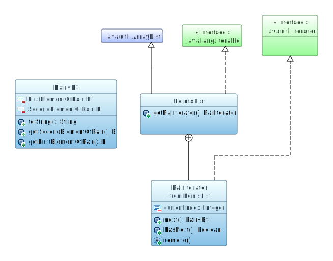

# PairIterator ( Парный итератор )
##Позволяет пробежать по списку точек парами.

##Проблема
Обычный итератор имеющийся в Java пробегает по элементам списка по одному.
А что если наш список представляет собой последовательность точек некоторой фигуры, от которой мы хотим вычислить периметр?

Тогда, продумав цикл, мы понимаем, что обычного цикла нам не будет достаточно - нам нужно будет внутри цикла вставлять условие.
Потому что при пробежке по списку точек, нам необходимо будет проверять каждый раз что точка не последняя, что бы на последней итерации вместо следующей точки взять нулевую (для последней точки в списке не будет следующий потому что это конец списка).

Получается довольно громоздкий код:  
```java
List<Point2D.Double> points = new ArrayList<>();
double perimetr = 0;
for (int i = 0; i < points.size(); i++){
    if(i == points.size() - 1){ // last iteration
        perimetr += points.get(i).x * points.get(0).y - points.get(0).x * points.get(i).y;
    }else{
        perimetr += points.get(i).x * points.get(i+1).y - points.get(i+1).x * points.get(i).y;
    }
}
```
Можно использовать итератор. Получится примерно что-то подобное:
```java
double perimetr = 0;
List<Point2D> points = new ArrayList<>();
Iterator<Point2D> iterator = points.iterator();
while (iterator.hasNext()){
    Point2D currentPoint = iterator.next();
    Point2D nextPoint = iterator.next();
    perimetr += Point.distance(currentPoint.getX(), currentPoint.getY(), nextPoint.getX(), nextPoint.getY());
}
```
Но и этот код придется ещё наполнять условиями, что увеличит его в размерах, 
и ухудшит понимание намного сильнее, чем в случае с обычным циклом.

## Решение
А можно написать свой итератор, который будет нам выдавать не одну точку, а одну пару точек.
Для начала представим что мы хотим получить в итоге:
```java
double perimeter = 0;
PointList<Point2D> points = new PointList<>();
Iterator<Pair<Point2D>> pairIterator = points.getPairIterator();
while (pairIterator.hasNext()){
    perimeter += Point.distance(
            pairIterator.next().getFirstElementOfPair().getX(),
            pairIterator.next().getFirstElementOfPair().getY(),
            pairIterator.next().getSecondElementOfPair().getX(),
            pairIterator.next().getSecondElementOfPair().getY()
    );
}
```
Что бы нам итератор возвращал пару надо сначала создать класс, которым эта пара будет представлена.
И так же необходимо написать свой итератор, который будет выдавать нам эти пары.

Давайте прикинем названия:
- PointList (`extends ArrayList implements Iterable`)
- PointList.PairIterator (`implements Iterator`)
- Pair

Если мы посмотрим на конструкцию класса `ArrayList`, то увидим в нём вложенный итератор.  

### class PointList extends ArrayList implements Iterable{...}
Нам же желательно поступить так же. То есть написать свою разновидность `ArrayList` - `PointList` и вложить в него свою реализацию интерфейса `Iterator` - `PairIterator`.  
Для этого мы будем использовать конструкцию ООП - наследование.
Делаем мы это для того, чтобы не переписывать заново уже имеющиеся механизмы работы списка, а просто дополнить их.
Наш наследник класса `ArrayList` будет отличаться лишь наличием в нём функции `getPairIterator()`, который будет для нас создавать наш итератор. Тем самым получается что для работы с итераторами наш список точек будет иметь функцию `iterator()`, предоставляющий доступ к обычному итератору, и функцию `getPairIterator()`, предоставляющую доступ к парному итератору.

### class PointList.PairIterator implements Iterator{...}
Наш итератор является реализацией интерфейса Iterator, а значит нам необходимо в нем определить поведение двух основных функций `hasNext()` и `next()`. То есть написать алгоритм, который нам ответит есть ли следующая пара и сможет выполнять действие перехода к следующему элементу.
Плюс ко всему мы еще переопределим метод `remove()` который необязателен для переопределения так как в  реализуемом нами интерфейсе он помечен как ***default*** и уже имеет тело.  
**Обратите внимание, что благодаря вложенности класса мы легко можем пользоваться функциями и свойствами верхнего класса `ArrayList` через формулировку `PointList.this.size()`  или просто `size()`**. 
Например


### class Pair {...}
Класс, котором будет описана пара тоже прост в исполнении. Этот класс должен иметь всего лишь два свойства `fistElement` и `secondElement`. И четыре геттера и сеттера для записи и чтения этих свойств. Конструктор класса логично будет построить из двух аргументов - первого и второго элемента. Проще говоря - что бы образовать пару необходим оба элемента, представляющих её и никак иначе.  
Так же в нашем классе можно переопределить метод `toString()` для того что бы при выводе в консоль нашего списка мы могли наглядно увидеть список наших точек с их координатами. `System.out.println(trianglePointsList)`

##Результат
Например, для треугольника наш итератор будет возвращать следующую последовательность точек:  
**(1, 2)→(2, 3)→(3, 1)**

Теперь напишем код, использующий наш итератор
```java
PointList<Point2D> trianglePoints = new PointList<>();
trianglePoints.add(new Point2D.Double(2, 1));
trianglePoints.add(new Point2D.Double(2, 6));
trianglePoints.add(new Point2D.Double(7, 1));

Iterator<Pair<Point2D>> iterator=  trianglePoints.getPairIterator();
while (iterator.hasNext()){
    System.out.println(iterator.next());
}
```

И получим результат

><span style="font-weight:bold; color:#1c4587">Pair</span> {Point2D.Double[2.0, 1.0], Point2D.Double[2.0, 6.0]}  
><span style="font-weight:bold; color:#1c4587">Pair</span> {Point2D.Double[2.0, 6.0], Point2D.Double[7.0, 1.0]}  
><span style="font-weight:bold; color:#1c4587">Pair</span> {Point2D.Double[7.0, 1.0], Point2D.Double[2.0, 1.0]}

##Диаграмма получившихся классов

